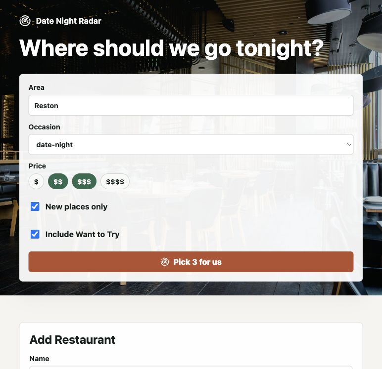
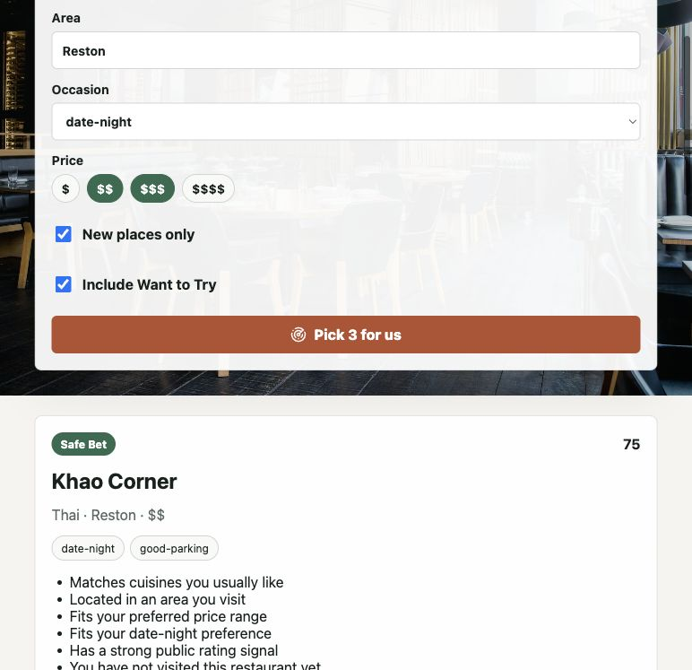

# Date Night Radar

Date Night Radar is a low-cost serverless MVP for remembering restaurants, tracking visits, and generating three explainable recommendations: Safe Bet, New Adventure, and Wildcard.

## Screenshots





## Stack

- React + Vite + TypeScript frontend in `apps/web`
- TypeScript Lambda API in `apps/api`
- DynamoDB single-table data model
- AWS CDK TypeScript infrastructure in `infra`
- Manual-only external restaurant search by default

## AI Measurement

This repo includes a lightweight AI measurement pilot for team-level workflow visibility:

- PR template AI usage declaration
- Automated AI usage labels
- CodeQL, CI, Dependabot, and security notes
- Dashboard and pulse survey guidance in [docs/ai-measurement-pilot.md](docs/ai-measurement-pilot.md)

## Local Setup

```bash
npm install
cp apps/api/.env.example apps/api/.env
npm run dev:api
npm run dev
```

The web app expects the API at `http://localhost:3001/api` by default. Set `VITE_API_BASE_URL` to override it.

## API Environment

```text
APP_ENV=dev
TABLE_NAME=RestaurantRadarTable
DEV_AUTH_BYPASS=true
DEFAULT_USER_ID=dev-user
EXTERNAL_SEARCH_PROVIDER=manual
LOG_LEVEL=info
```

`DEV_AUTH_BYPASS=true` uses `DEFAULT_USER_ID` for local development. Production should validate Cognito JWTs at API Gateway/Lambda and set `DEV_AUTH_BYPASS=false`.

## Deploy

Prerequisites:

- An AWS account
- AWS CLI configured with credentials for that account
- CDK bootstrapped once per AWS account/region

```bash
npm install
npm run build
npm run cdk -- bootstrap
npm run cdk -- deploy -c authMode=cognito -c budgetEmail=you@example.com -c monthlyBudgetLimit=10
```

The `authMode=cognito` stack protects API routes with a Cognito authorizer. The current frontend still needs a sign-in flow before that mode is usable from the browser.

For a temporary private demo only, deploy with:

```bash
npm run cdk -- deploy -c authMode=dev -c budgetEmail=you@example.com -c monthlyBudgetLimit=10
```

The `authMode=dev` deployment uses `DEV_AUTH_BYPASS=true` with `DEFAULT_USER_ID=dev-user`. Do not use it for a public or production deployment.

The CDK stack creates S3 + CloudFront, API Gateway HTTP API, Lambda, DynamoDB, Cognito, and least-privilege table access. It also uploads `apps/web/dist` to the hosting bucket and invalidates CloudFront.

To remove the deployed AWS resources:

```bash
npm run cdk -- destroy
```

## Cost Controls

- Lambda, DynamoDB on-demand, S3, CloudFront, and HTTP API avoid always-on compute.
- External search defaults to manual mode and is abstracted behind a provider interface.
- Cache imported restaurant records in DynamoDB before calling any future paid provider.
- Lambda CloudWatch logs are retained for one week.
- Keep logs concise and avoid logging notes, secrets, tokens, or API keys.
- Pass `-c budgetEmail=you@example.com` during deploy to create AWS Budget email alerts.
- Budget alerts fire at actual spend of $1, $5, and the monthly limit. The stack also sends a forecasted alert if AWS estimates the monthly limit will be exceeded.
- The default monthly budget limit is $10. Override it with `-c monthlyBudgetLimit=5` or another dollar amount.
- AWS Budgets are alerts, not a universal hard spending cap. For a hard-stop style control later, add AWS Budget Actions, service quotas, or account-level guardrails.

## MVP Checklist

- Preferences can be created and edited.
- Restaurants can be added manually.
- Restaurants can be saved as Want to Try, archived, or marked visited.
- Visits store rating, return intent, occasion, tags, and notes.
- Recommendation engine returns three scored cards with deterministic explanations.
- Manual-only mode works without external API keys.
